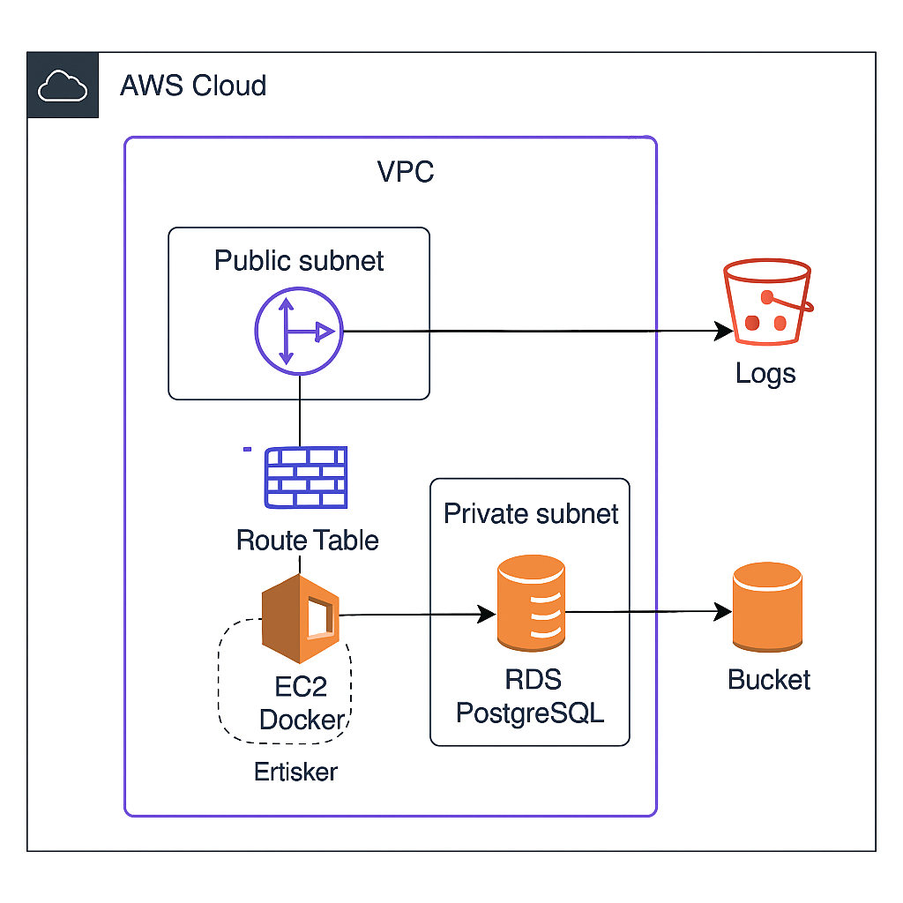

# Estrutura completa do projeto Terraform AWS

# Infraestrutura AWS com Terraform

Este projeto provisiona uma infraestrutura completa na AWS utilizando Terraform, incluindo:
- VPC com subnets públicas e privadas
- Instância EC2 com Docker
- Banco de dados PostgreSQL (RDS)
- Bucket S3 para armazenamento de logs
- IAM roles e policies para segurança

## Diagrama de Arquitetura



## Estrutura do Projeto

```
terraform-aws-infra/
├── main.tf              # Configuração principal
├── variables.tf         # Definição de variáveis
├── outputs.tf           # Outputs do Terraform
├── terraform.tfvars     # Valores das variáveis
├── providers.tf         # Configuração do provider AWS
├── backend.tf           # Configuração do backend
├── modules/             # Módulos Terraform
│   ├── vpc/             # Configuração de rede
│   ├── ec2/             # Instância EC2 com Docker
│   ├── rds/             # Banco de dados PostgreSQL
│   ├── s3/              # Bucket S3 para logs
│   └── iam/             # Roles e policies IAM
└── docs/                # Documentação
    └── architecture_diagram.png
```

## Pré-requisitos

- Terraform >= 1.2.0
- AWS CLI configurado com credenciais
- Bucket S3 para armazenamento de estado (opcional)

## Como usar

1. Clone este repositório:
   ```bash
   git clone https://github.com/seu-usuario/terraform-aws-infra.git
   cd terraform-aws-infra
   ```

2. Personalize as variáveis no arquivo `terraform.tfvars` conforme necessário.

3. Inicialize o Terraform:
   ```bash
   terraform init
   ```

4. Verifique o plano de execução:
   ```bash
   terraform plan
   ```

5. Aplique a configuração:
   ```bash
   terraform apply
   ```

6. Após a conclusão, anote os outputs (incluindo o IP público da EC2 e o endpoint do RDS).

## Acessando a aplicação

1. Acesse a aplicação web pelo navegador:
   ```
   http://<IP-PUBLICO-EC2>
   ```

2. Para a aplicação Flask:
   ```
   http://<IP-PUBLICO-EC2>:5000
   ```

## Segurança

- O RDS está em uma subnet privada, acessível apenas pela EC2
- O bucket S3 tem acesso público bloqueado
- Bloqueio de acesso público habilitado
- IAM com permissões mínimas necessárias

## Limpeza

Para destruir toda a infraestrutura:
```bash
terraform destroy
```

## Considerações

- Este projeto foi criado para fins demonstrativos
- Em ambiente de produção, considere:
  - Usar NAT Gateway para permitir acesso à internet da subnet privada
  - Configurar backup automático para o RDS
  - Implementar monitoramento e alarmes
  - Configurar um domínio personalizado com SSL
  - Implementar CI/CD para o deployment da aplicação